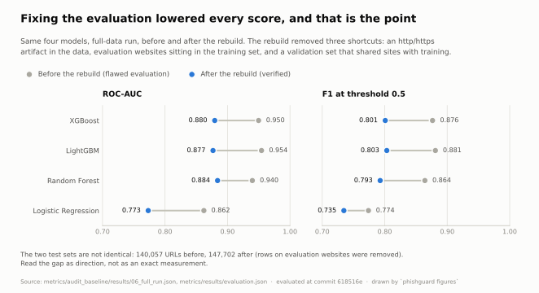
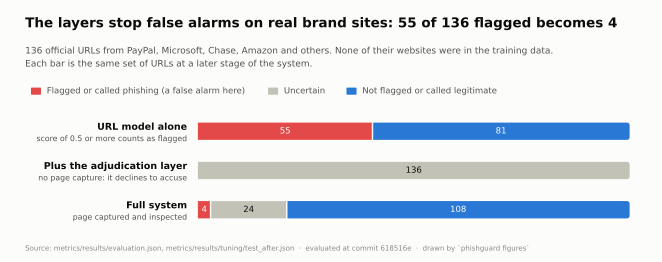
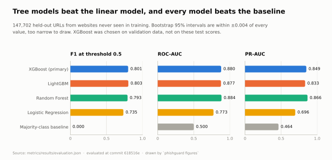
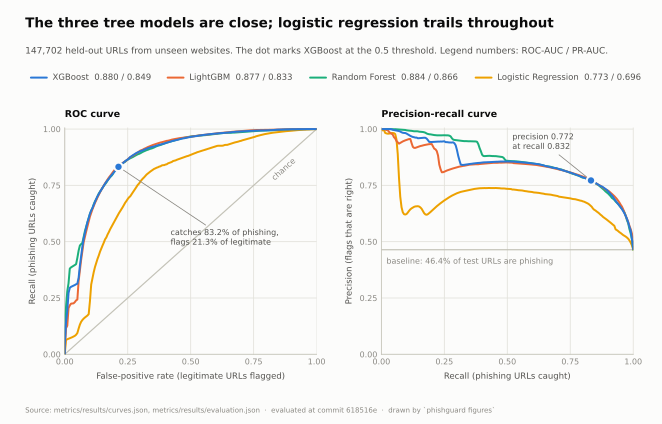
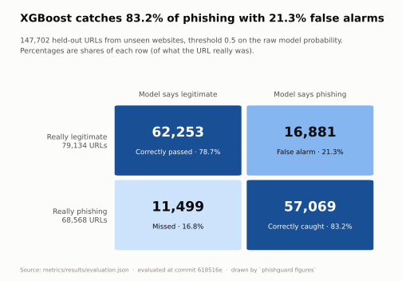
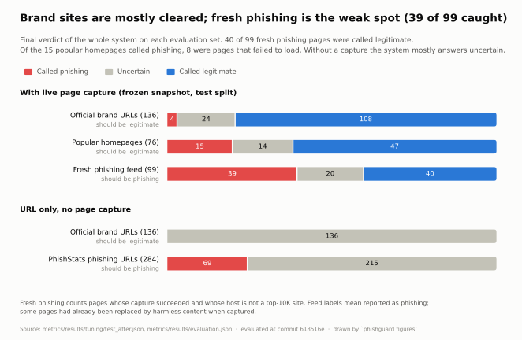
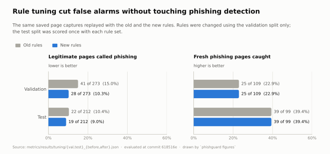
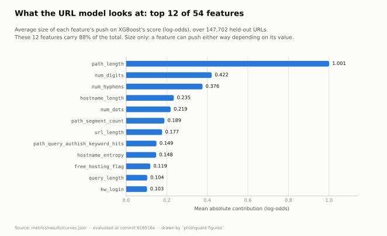
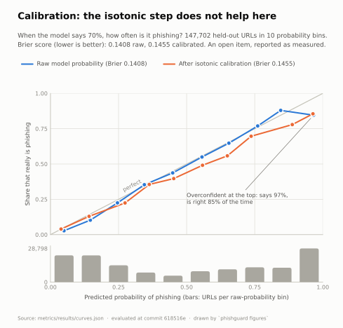
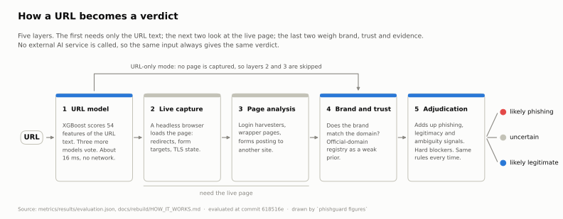

# Figures

Every figure here is drawn by `phishguard figures` from the result files in `metrics/results/` (and the pre-rebuild audit in `metrics/audit_baseline/`). Nothing is typed by hand. The numbers were measured at commit `618516e`. Each chart comes in a light and a dark version; the table under it holds the plotted values.

## Held-out scores before and after the evaluation was fixed

<picture>
  <source media="(prefers-color-scheme: dark)" srcset="rebuild_before_after-dark.svg">
  
</picture>

| Model | Metric | Before rebuild | After rebuild | Change |
|---|---|---|---|---|
| XGBoost (primary) | ROC-AUC | 0.950 | 0.880 | -0.070 |
| LightGBM | ROC-AUC | 0.954 | 0.877 | -0.078 |
| Random Forest | ROC-AUC | 0.940 | 0.884 | -0.056 |
| Logistic Regression | ROC-AUC | 0.862 | 0.773 | -0.089 |
| XGBoost (primary) | F1 at threshold 0.5 | 0.876 | 0.801 | -0.076 |
| LightGBM | F1 at threshold 0.5 | 0.881 | 0.803 | -0.078 |
| Random Forest | F1 at threshold 0.5 | 0.864 | 0.793 | -0.072 |
| Logistic Regression | F1 at threshold 0.5 | 0.774 | 0.735 | -0.039 |

## What each layer does to 136 real brand URLs

<picture>
  <source media="(prefers-color-scheme: dark)" srcset="layers_on_brand_sites-dark.svg">
  
</picture>

| Stage | Flagged / phishing | Uncertain | Not flagged / legitimate | False-alarm rate |
|---|---|---|---|---|
| URL model alone | 55 | 0 | 81 | 40.4% |
| Plus the adjudication layer | 0 | 136 | 0 | 0.0% |
| Full system | 4 | 24 | 108 | 2.9% |

## Four models and a baseline on the held-out test set

<picture>
  <source media="(prefers-color-scheme: dark)" srcset="model_comparison-dark.svg">
  
</picture>

| Model | F1 | F1 95% CI | ROC-AUC | PR-AUC | Precision | Recall | False-positive rate |
|---|---|---|---|---|---|---|---|
| XGBoost (primary) | 0.801 | 0.799 to 0.803 | 0.880 | 0.849 | 0.772 | 0.832 | 21.3% |
| LightGBM | 0.803 | 0.801 to 0.806 | 0.877 | 0.833 | 0.764 | 0.847 | 22.7% |
| Random Forest | 0.793 | 0.791 to 0.795 | 0.884 | 0.866 | 0.784 | 0.802 | 19.2% |
| Logistic Regression | 0.735 | 0.732 to 0.737 | 0.773 | 0.696 | 0.679 | 0.800 | 32.8% |
| Majority-class baseline | 0.000 | n/a | 0.500 | 0.464 | 0.000 | 0.000 | 0.0% |

## ROC and precision-recall curves on the held-out test set

<picture>
  <source media="(prefers-color-scheme: dark)" srcset="roc_pr_curves-dark.svg">
  
</picture>

| Model | ROC-AUC (evaluation.json) | PR-AUC (evaluation.json) | ROC-AUC of the drawn curve | PR-AUC of the drawn curve |
|---|---|---|---|---|
| XGBoost (primary) | 0.880 | 0.849 | 0.8796 | 0.8493 |
| LightGBM | 0.877 | 0.833 | 0.8768 | 0.8328 |
| Random Forest | 0.884 | 0.866 | 0.8841 | 0.8661 |
| Logistic Regression | 0.773 | 0.696 | 0.7734 | 0.6971 |

The curves are re-scored from the model files in `models/layer1`. They match `evaluation.json` exactly except: logistic_regression.roc_auc differs by 0.0002, logistic_regression.pr_auc differs by 0.0013. The chart legend shows the `evaluation.json` values.

## Confusion matrix of the primary model on the held-out test set

<picture>
  <source media="(prefers-color-scheme: dark)" srcset="confusion_matrix-dark.svg">
  
</picture>

|  | Model says legitimate | Model says phishing |
|---|---|---|
| Really legitimate | 62,253 | 16,881 |
| Really phishing | 11,499 | 57,069 |

## Final verdicts per evaluation set, with and without page capture

<picture>
  <source media="(prefers-color-scheme: dark)" srcset="verdicts_by_set-dark.svg">
  
</picture>

| Mode | Set | Expected | Called phishing | Uncertain | Called legitimate |
|---|---|---|---|---|---|
| With live page capture (frozen snapshot, test split) | Official brand URLs (136) | should be legitimate | 4 | 24 | 108 |
| With live page capture (frozen snapshot, test split) | Popular homepages (76) | should be legitimate | 15 | 14 | 47 |
| With live page capture (frozen snapshot, test split) | Fresh phishing feed (99) | should be phishing | 39 | 20 | 40 |
| URL only, no page capture | Official brand URLs (136) | should be legitimate | 0 | 136 | 0 |
| URL only, no page capture | PhishStats phishing URLs (284) | should be phishing | 69 | 215 | 0 |

## Rule tuning on a frozen live snapshot, before and after

<picture>
  <source media="(prefers-color-scheme: dark)" srcset="rule_tuning-dark.svg">
  
</picture>

| Measure | Split | Rules | Count | Rate |
|---|---|---|---|---|
| Legitimate pages called phishing | Validation | before | 41 of 273 | 15.0% |
| Legitimate pages called phishing | Validation | after | 28 of 273 | 10.3% |
| Legitimate pages called phishing | Test | before | 22 of 212 | 10.4% |
| Legitimate pages called phishing | Test | after | 19 of 212 | 9.0% |
| Fresh phishing pages caught | Validation | before | 25 of 109 | 22.9% |
| Fresh phishing pages caught | Validation | after | 25 of 109 | 22.9% |
| Fresh phishing pages caught | Test | before | 39 of 99 | 39.4% |
| Fresh phishing pages caught | Test | after | 39 of 99 | 39.4% |

## Which URL features move the primary model's score most

<picture>
  <source media="(prefers-color-scheme: dark)" srcset="feature_contributions-dark.svg">
  
</picture>

| Rank | Feature | Mean absolute contribution (log-odds) | Mean signed contribution |
|---|---|---|---|
| 1 | `path_length` | 1.0007 | -0.0035 |
| 2 | `num_digits` | 0.4215 | -0.0284 |
| 3 | `num_hyphens` | 0.3764 | -0.0741 |
| 4 | `hostname_length` | 0.2349 | +0.0094 |
| 5 | `num_dots` | 0.2190 | +0.0613 |
| 6 | `path_segment_count` | 0.1886 | -0.0188 |
| 7 | `url_length` | 0.1773 | -0.0103 |
| 8 | `path_query_authish_keyword_hits` | 0.1493 | +0.0049 |
| 9 | `hostname_entropy` | 0.1476 | +0.0221 |
| 10 | `free_hosting_flag` | 0.1189 | +0.1119 |
| 11 | `query_length` | 0.1039 | +0.0030 |
| 12 | `kw_login` | 0.1028 | +0.0392 |
| 13 | `domain_hash_bucket` | 0.0754 | +0.0339 |
| 14 | `suspicious_keyword_count` | 0.0631 | +0.0135 |
| 15 | `host_brand_substring_not_official` | 0.0442 | +0.0193 |
| 16 | `has_ip_address` | 0.0434 | +0.0172 |
| 17 | `simple_public_web_shape` | 0.0402 | +0.0014 |
| 18 | `path_brand_token_present` | 0.0396 | +0.0008 |
| 19 | `subdomain_count` | 0.0311 | +0.0090 |
| 20 | `path_shallow_le2` | 0.0311 | -0.0018 |
| 21 | `no_authish_path_query_tokens` | 0.0301 | -0.0007 |
| 22 | `kw_account` | 0.0147 | +0.0003 |
| 23 | `path_shallow_le1` | 0.0085 | -0.0005 |
| 24 | `kw_verify` | 0.0082 | +0.0025 |
| 25 | `num_special_chars` | 0.0081 | +0.0026 |
| 26 | `num_brand_tokens_in_path` | 0.0027 | -0.0001 |
| 27 | `num_brand_tokens_in_host` | 0.0023 | +0.0002 |
| 28 | `official_domain_family` | 0.0021 | +0.0019 |
| 29 | `has_at_symbol` | 0.0018 | +0.0000 |
| 30 | `kw_secure` | 0.0015 | +0.0004 |
| 31 | `path_brand_without_official_host` | 0.0014 | -0.0001 |
| 32 | `kw_update` | 0.0012 | -0.0001 |
| 33 | `punycode_flag` | 0.0010 | -0.0001 |
| 34 | `brand_typosquat_embedded_in_label` | 0.0010 | +0.0002 |
| 35 | `brand_hyphenated_deception_label` | 0.0010 | +0.0001 |
| 36 | `kw_confirm` | 0.0002 | -0.0001 |
| 37 | `port_present` | 0.0001 | +0.0001 |
| 38 | `suspicious_redirect_query_flag` | 0.0000 | -0.0000 |
| 39 | `cloud_hosting_flag` | 0.0000 | +0.0000 |
| 40 | `brand_hostname_exact_label_match` | 0.0000 | +0.0000 |
| 41 | `kw_password` | 0.0000 | -0.0000 |
| 42 | `official_registrable_anchor` | 0.0000 | -0.0000 |
| 43 | `kw_payment` | 0.0000 | +0.0000 |
| 44 | `private_host_flag` | 0.0000 | +0.0000 |
| 45 | `brand_on_free_hosting` | 0.0000 | +0.0000 |
| 46 | `brand_on_cloud_placeholder` | 0.0000 | +0.0000 |
| 47 | `layer1_brand_trust_score` | 0.0000 | +0.0000 |
| 48 | `legit_auth_surface_on_official_anchor` | 0.0000 | +0.0000 |
| 49 | `legit_admin_like_path_on_official_anchor` | 0.0000 | +0.0000 |
| 50 | `legit_checkout_like_path_on_official_anchor` | 0.0000 | +0.0000 |
| 51 | `simple_official_homepage_shape` | 0.0000 | +0.0000 |
| 52 | `dns_features_skipped` | 0.0000 | +0.0000 |
| 53 | `url_features_missing` | 0.0000 | +0.0000 |
| 54 | `hosting_features_missing` | 0.0000 | +0.0000 |

## Calibration of the primary model's probability

<picture>
  <source media="(prefers-color-scheme: dark)" srcset="calibration-dark.svg">
  
</picture>

| Probability | Bin | URLs | Mean predicted | Observed phishing rate |
|---|---|---|---|---|
| Raw | 0.0 to 0.1 | 22,888 | 0.050 | 0.028 |
| Raw | 0.1 to 0.2 | 22,850 | 0.146 | 0.103 |
| Raw | 0.2 to 0.3 | 14,347 | 0.246 | 0.225 |
| Raw | 0.3 to 0.4 | 8,163 | 0.345 | 0.354 |
| Raw | 0.4 to 0.5 | 5,504 | 0.449 | 0.437 |
| Raw | 0.5 to 0.6 | 9,268 | 0.556 | 0.550 |
| Raw | 0.6 to 0.7 | 10,944 | 0.655 | 0.648 |
| Raw | 0.7 to 0.8 | 12,637 | 0.761 | 0.769 |
| Raw | 0.8 to 0.9 | 12,303 | 0.845 | 0.879 |
| Raw | 0.9 to 1.0 | 28,798 | 0.966 | 0.845 |
| Calibrated | 0.0 to 0.1 | 30,833 | 0.039 | 0.040 |
| Calibrated | 0.1 to 0.2 | 16,672 | 0.142 | 0.130 |
| Calibrated | 0.2 to 0.3 | 12,952 | 0.274 | 0.224 |
| Calibrated | 0.3 to 0.4 | 7,322 | 0.363 | 0.355 |
| Calibrated | 0.4 to 0.5 | 1,965 | 0.453 | 0.397 |
| Calibrated | 0.5 to 0.6 | 1,069 | 0.558 | 0.491 |
| Calibrated | 0.6 to 0.7 | 18,968 | 0.649 | 0.558 |
| Calibrated | 0.7 to 0.8 | 2,122 | 0.737 | 0.697 |
| Calibrated | 0.8 to 0.9 | 18,451 | 0.888 | 0.779 |
| Calibrated | 0.9 to 1.0 | 37,348 | 0.964 | 0.855 |

## How a URL moves through the system

<picture>
  <source media="(prefers-color-scheme: dark)" srcset="architecture-dark.svg">
  
</picture>

| Layer | Name | What it does |
|---|---|---|
| 1 | URL model | XGBoost scores 54 features of the URL text. Three more models vote. About 16 ms, no network. |
| 2 | Live capture | A headless browser loads the page: redirects, form targets, TLS state. |
| 3 | Page analysis | Login harvesters, wrapper pages, forms posting to another site. |
| 4 | Brand and trust | Does the brand match the domain? Official-domain registry as a weak prior. |
| 5 | Adjudication | Adds up phishing, legitimacy and ambiguity signals. Hard blockers. Same rules every time. |
